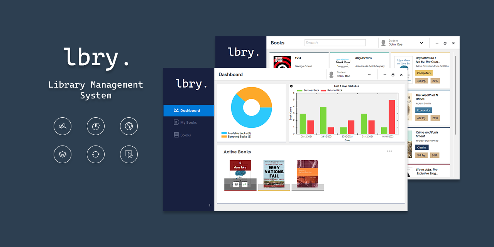
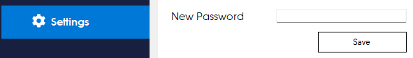
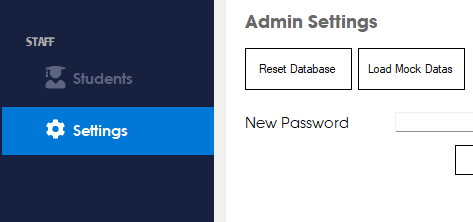
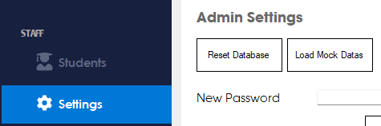
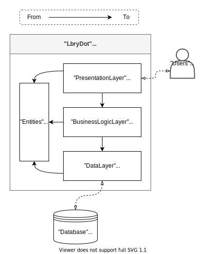
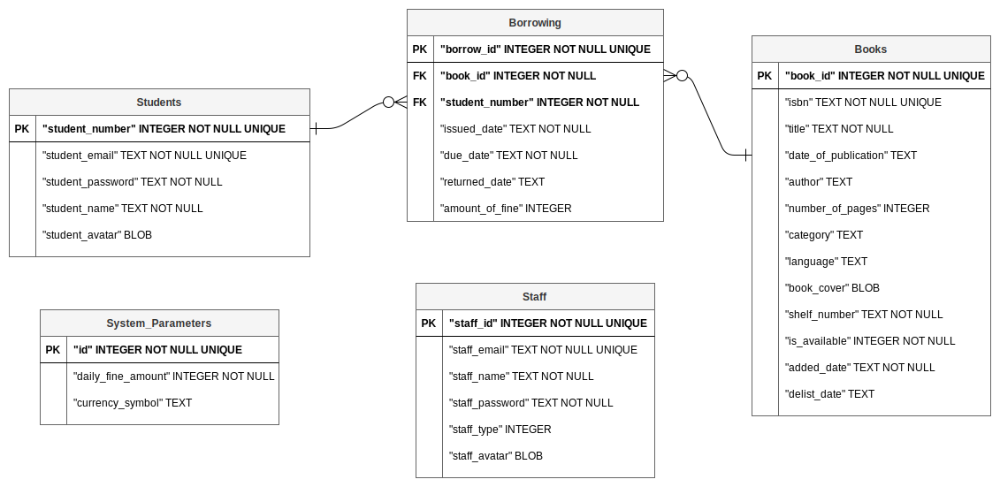

#   

**lbry.** is a Library Management System designed to be used in school libraries. Built for Windows Desktop platform. Enables to manage, track and automate core functions of a library with an intuitive user interface.

## Key Features

**User Management**
lbry. Provides staff, student user roles and handles their authentications. Makes able to manage easily these user roles. Provides user role specific data views and user role specific operations.

**Data Store and Visualization**
lbry. stores book, student, staff metadata and their dynamic historical datas(Eg. borrowing, book availability). And visualizes these datas as a charts, book catalogue or student-staff list to make tracking easier.

**Multi Lingual**
lbry. provides English and Turkish languages for the user interface. Supports multi-language books, searching books by languages, multi-language book categories.

**Book Borrowing**
lbry. automates book borrowing operations. Maintains book circulation. Calculates late fees when returning a book. Makes borrow and return book operations easy as one click.

**Book Catalogue**
lbry. provides a manageable book catalogue for browsing all the books and makes able to search over books by isbn number, title, category name or publish date parameters.

**User Interface**
lbry. has modern looking interactive interface. Lets users to act without thinking. Uses Color Tagging method to make user aware of borrowed book statuses and book categories.

## Screenshots

| Login Page      |  |
| :-------- | ------|
|   |  |

| Staff Dashboard      | Student Dashboard |
| :-------- | ------|
|   |   |

| Books Page(Staff)     | Books Page(Student)  |
| :-------- | ------|
|   |   |

| Settings Page(Admin)        |  |
| :-------- | ------|
|   |  |

## Installation

lbry. is available as a installable MSI package version or as a portable ZIP package version. Desired version can be downloaded from the [Releases](https://github.com/nmelihsensoy/LbryDot/releases) page of this repository.

## Quick Start

### First Login

After running the app, Login page will welcomes you. You can use the following credentials for the first login.

Email  | Password
------------- | -------------
`admin`  | `admin`

After you logged in, changing the password for the `admin` account is recommended.

### Changing The Admin Password

Admin password can be changed from Admin Settings widget in the Settings page.



### Resetting The Database

This operation will delete all the books, students, staffs, borrowing records and reset admin password to the default.

Admin can reset the database from Admin Settings widget in the Settings page. Clicking Reset Database button will reset the database.



### Loading Mock Data

Admin can add mock data to see how the system works or for other purposes. System will load following data after clicking the Load Mock Data button.

13 books, 1 staff, 2 students, 20 book borrowing operation which 5 of them are not returned yet data will be loaded.

Database reset is required before loading the mock data. For the first login, resetting the database is not required.



After successfully load the mock data, following credentials will be available to use.

Staff
Email  | Password
------------- | -------------
`jane_smith@lbry.com`  | `jane1234`

Students
Email  | Password
------------- | -------------
`john_doe@lbry.com`  | `john1234`
`deniz_kaya@lbry.com`  | `deniz1234`

## Technical Documentation

Application is designed with using architecture that known as n-tier, multitier, multilayer or layered. Chosen architecture divides application into individual and interoperable layers where they can be developed simultaneously with its own dependencies. Microsoft suggested layered architecture in [here](https://docs.microsoft.com/en-us/previous-versions/msp-n-p/ee658109(v=pandp.10)). More information can be found in [here](https://en.wikipedia.org/wiki/Multitier_architecture).

In the implementation of the described architecture for this application, totally 4 layers has been defined. 3 of these layers are commonly used:

* Presentationlayer aka Presentation Layer
* Datalayer aka Data access layer
* BusinessLogicLayer aka Business layer

layers. And the last layer is:  

* Entities

C# programming language, .NET Framework and Microsoft Visual Studio Development Environment are chosen for the application. Chosen environment offers [Solutions as Containers](https://docs.microsoft.com/en-us/previous-versions/visualstudio/visual-studio-2010/df8st53z(v=vs.100)?redirectedfrom=MSDN) for organizing and storing multiple projects. Solutions uses references for linking external or internal projects.

Previously defined layers are implemented as a .NET Projects in a Solution named **"LbryDot"**. And the reference diagram for these layers as following :



### PresentationLayer

This layer handles the user interface. [WinForms](https://github.com/dotnet/winforms), [FontAwesome](https://www.nuget.org/packages/FontAwesome.Sharp/) and [ZedGraph](https://sourceforge.net/projects/zedgraph/) tools are used.

### Entities

This layer contains POCO classes and common Enum definitions.

### BusinessLogicLayer

This layer processes user inputs to make logical decisions, sends data to DataLayer, returns data to PresentationLayer from DataLayer, defines validation rules and validates data coming from PresentationLayer.

#### CustomAppContext

Initiates database connection, stores UnitOfWork, stores logged users and system parameters. Provides UnitOfWork access to the services. One instance of CustomAppContext is initialized at the start and carried over to services.  

#### Services

Services are created here. Service is a operation logic provider for entities. Validators are used here.

#### Validators

Validators are created here. Validator is a sum of validation rules for an Entity. [FluentValidation](https://www.nuget.org/packages/FluentValidation/) is used.

### DataLayer

This layer contains data access logic. Handles operations on the database.

#### DatabaseProvider

Defines database connection logic. Provides an interface for different type of databasess. [SQLite](https://www.nuget.org/packages/System.Data.SQLite/) is used for database.

#### Repositories

Repository pattern and ORM technique is used. This sublayer contains repository definitions of Entities. [Dapper](https://www.nuget.org/packages/Dapper/) tool is chosen for ORM technique.

#### UnitOfWork

Unit of Work pattern is used. Merges database operations came from Services into one single transaction. Relays the DatabaseProvider between Repositories. Provides one interface to Services for accessing all the repositories.

Layers, tools, patterns and their relations presented as the following diagram:


ER diagram for the database is as the following:



### Borrowing Logic

#### Borrow Book

When user borrows a book, a record is added to the Borrowing table. That record's `returned_date` column is kept as NULL.

#### Return Book

When user returns a book, That record's `returned_date` column is set to current timestamp.

### Historical Total Book Count Calculation

Book records are saved in a Books table as following:

| book_id |     isbn      |              title               | date_of_publication |    author     | number_of_pages |     category     | language | book_cover | shelf_number | is_available |         added_date          | delist_date |
|---------|---------------|----------------------------------|---------------------|---------------|-----------------|------------------|----------|------------|--------------|--------------|-----------------------------|-------------|
| 12      | 9780141361345 | Alice's Adventures in Wonderland | 2015                | Lewis Carroll | 192             | Classics29,53,87 | English  |            | 7A           | 1            | 2021-12-21 09:45:11.9885397 |             |

When the book is added, `added_date` value is set to current timestamp. When the book is removed `delist_date` value is set from `NULL` to current timestamp. Row is not deleted. Historical total book count is calculated by using `added_date`, `delist_date` columns. Cumulative Frequency table for merged `added_date` and `delist_date` columns is calculate. Then count of rows that has not null `delist_date` value is subtract from tables relevant element. This method implemented as the following sql query:

```sql
SELECT Date1 as date, SUM(MAX(NUM)-MAX(NUM2)) OVER (ORDER BY Date1) AS count FROM
(
SELECT DATE(added_date) as Date1, COUNT(*) AS NUM, 0 AS NUM2 FROM Books GROUP BY Date1
UNION
SELECT DATE(delist_date) as Date2, 0, COUNT(*) FROM Books WHERE delist_date IS NOT NULL GROUP BY Date2
)
GROUP BY Date1
;
```

This query is giving the following output:

date  | count
------------- | -------------
2021-12-15 | 1
2021-12-16 | 2
2021-12-17 | 3
2021-12-18 | 9
2021-12-19 | 13
2022-01-14 | 12

### Historical Available Book Count Calculation

Book borrowings are saved in Borrowing table as following:

| borrow_id | book_id | student_number |     issued_date     |      due_date       |    returned_date    | amount_of_fine |
|-----------|---------|----------------|---------------------|---------------------|---------------------|----------------|
| 3         | 8       | 3              | 2022-01-05 00:00:00 | 2022-01-26 00:00:00 |                     | 0              |
| 4         | 12      | 3              | 2022-01-12 00:00:00 | 2022-01-26 00:00:00 | 2022-01-15 00:00:00 | 0              |

Available book count only changes when someone returns a book. And `returned_date` column value is changed `NULL` to `current timestamp` when someone returns a book. Therefore historical borrowed book count can be calculated using `returned_data` column with following method. For every unique `returned_date` value, count cumulative borrowed book and cumulative returned book then substract cumulative returned book count from cumulative borrowed book count.

This query gives the chart x axis points:

```sql
SELECT date(returned_date) AS date FROM Borrowing WHERE returned_date IS NOT NULL GROUP BY date;
```

date  |
------------- |
2021-12-15 |
2021-12-20 |
2021-12-22 |
2022-01-05 |
2022-01-06 |
2022-01-07 |
2022-01-08 |
2022-01-09 |

Available count calculation for `2021-12-15`:

Count of the rows that has issued_date value earlier or equal than `2021-12-15:

```sql
SELECT COUNT(*) AS C1 FROM Borrowing WHERE date(issued_date) <=  '2021-12-15';
```

C1  |
------------- |
2 |

Count of the rows that has returned_date earlier or equal than `2021-12-15`:

```sql
SELECT COUNT(*)  AS C2 FROM Borrowing WHERE date(returned_date) <= '2021-12-15'
```

C2  |
------------- |
1 |

| C1 | C2 | C1-C2 |
|----|----|-------|
| 2  | 1  | 1     |

`C1-C2 = 1` : This amount of book has been borrowed in date of `2021-12-15`. Intraday activities does not affect the output, only the day close is considered.

So, `(Total book count on the day of '2021-12-15') - (C1-C2)` formula gives the available book count for wanted day.

Following sql query is combination of the previous queries. It applies the explained method to every x axis point.

```sql
SELECT A.returned_date AS date, (LessThanCount-A.RETURNED_COUNT) AS count FROM (SELECT BRW.returned_date, BRW.issued_date, SUM(IFNULL(B.LessThanCount, 0)) as LessThanCount 
FROM Borrowing BRW
LEFT JOIN (SELECT issued_date, COUNT(*) as LessThanCount FROM Borrowing GROUP BY issued_date)B ON B.issued_date <=  BRW.returned_date
WHERE BRW.returned_date IS NOT NULL
GROUP BY BRW.borrow_id, BRW.returned_date
ORDER BY BRW.returned_date ASC) LTC
LEFT JOIN (SELECT returned_date, SUM(NUM) OVER(ORDER BY returned_date ASC) AS RETURNED_COUNT FROM (SELECT returned_date, COUNT(*) AS NUM FROM Borrowing WHERE returned_date IS NOT NULL GROUP BY returned_date))A ON A.returned_date = LTC.returned_date
GROUP BY LTC.returned_date;
```

date  | count
------------- | -------------
2021-12-15 00:00:00 | 1
2021-12-20 00:00:00 | 1
2021-12-22 00:00:00 | 0
2022-01-05 00:00:00 | 6
2022-01-06 00:00:00 | 9
2022-01-07 00:00:00 | 8
2022-01-08 00:00:00 | 9
2022-01-09 00:00:00 | 5

### Ui Localization

Achiving to support multi lingual user interface, every text that shown to user is stored in Resources with `Strings.<lang-code>.resx` file. `Strings.resx` file without any abbreviation stores texts for English language. `Strings.tr.resx` file stores texts for Turkish language. New languages can be added with creating a `Strings.<lang-code>.resx` file using ISO language codes (Eg: fr-FR, de-DE) or custom codes(Eg: tr, lorem, example). Application language can be changed during the runtime with using `PresentationLayer.Helpers.ChangeLanguage` function.

`Strings.resx`:

Name  | Value
------------- | -------------
AdminRole | Admin

`Strings.tr.resx`:
Name  | Value
------------- | -------------
AdminRole | Yönetici

### Ui Color Template

Colors that used in form controls are stored in `ColorPalette` class with the relevantly named variables.Color template can't be changed during the runtime.

`ColorPalette.cs`

```C#
public static Color MainSidebarForeColor = Color.FromArgb(92, 100, 128);
```

### App.Config File

#### Password Hash Salt

User passwords are stored as md5 hash with salt in the database. Salt is defined in App.Config file as following:

```xml
  <appSettings>
    <add key="Salt" value="lbry*~0Yn" />
  </appSettings>
```

#### Connection Strings

SQLite database file path is contained here. Empty database and currently used database is defined in this section. Empty database is stored with `Empty` name, currently used database is stored with `Default` name. `Empty` version is stored to able to reset database.

#### Editions

Different config files are used for the `Portable` and `Installer` edition of the application. For `Portable` edition, database files are contained in the same directory as the executable file. Corresponding config file for this version is as the following:

App.config file:

```xml
<connectionStrings>
    <add name="Default" connectionString="Data Source=.\lbrydot_db.db;Version=3;" providerName="System.Data.SqlClient" />
    <add name="Empty" connectionString="Data Source=.\lbrydot_db.bak" /> 
</connectionStrings>
```

For `Installer` edition, currently used database is stored as `%AppData%\LbryDot\lbrydot_db.db` path. Corresponding config file for this version is as the following:

App.Installer.config file:

```xml
<connectionStrings>
    <add name="Default" connectionString="Data Source=$LbryAppDataPath$\lbrydot_db.db;Version=3;" providerName="System.Data.SqlClient" />
    <add name="Empty" connectionString="Data Source=.\lbrydot_db.bak" />
</connectionStrings>
<appSettings>
    <add key="AppDataFolderName" value="LbryDot" />
</appSettings>
```

`$LbryAppDataPath$` is replaced with value of the `appSettings`->`AppDataFolderName` key at the runtime.

### Development

After cloning or downloading the repository, open `src/LbryDot.sln` file with your IDE. Visual Studio 2019 or more is recomended. IDE will handle .NET version problems and automatically install the nuget packages.

### Build & Distribution